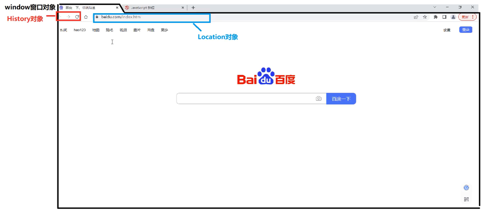

# JS
- https://www.bilibili.com/video/BV1hP411679m/?p=10&spm_id_from=pageDriver&vd_source=1508b9a92b58beae7f2da553b09aff88
- 文档参考：https://developer.mozilla.org/zh-CN/docs/Web/JS


<style>
    showpane {
        display: block;
        border: 1px dashed 	#778899;
        border-radius: 10px;
        padding: 5px;
        margin-bottom: 50px;
    }
</style>

# 概述
**JavaScript三大部分**
1. ECMA script基础语法
2. DOM操作：文档操作，可以控制页面结构
3. BOM操作：浏览器操作，可以控制浏览器行为


# 注释
- 单行注释
```js
// 注释
```
- 多行注释
```js
/*
    多行注释
*/
```

# 引入JS
- 直接内部写
```html
<script>
    console.log("HELLO");
</script>
```
- 外部文件引入
```html
<script src="js/test.js"></script>
```

# 变量

## 命名规则
1. 只能使用数字、字母、下划线_、美元符$
2. 不能以数字开头
3. 严格区分大小写
4. 使用驼峰命名
5. 不可使用关键字为变量名

## 变量赋值


## 变量作用范围
- `局部变量`：**只有在函数内定义的才是局部变量，范围是函数内**
- `全局变量`：除了函数内定义的，其他都是全局变量

```js
function func() {
    var a = 10;
}
// console.log(a); // a is not defined


if(false) {
    var b = 20;
}
console.log(b); // undefined 申明了但是没有赋值

if(true) {
    var c = 30;
}
console.log(c); // 30


while(false) {
    var d = 40;
}
console.log(d); // undefined

for(var i=0; i<10; i++) {

}
console.log(i); // 10
```


**先定义后赋值**
```js
var name;
var age, addr;

name = "张三";
age = 18;
addr = "北京市";
```

**定义同时赋值**
```js
var name = "张三";
var age = 18, addr = "北京市";
```

# 数据类型


## 基本数据类型

### undefined
- 只声明没有值的变量
```js
var t;
console.log(t); // undefined
console.log(typeof t); // undefined
```

### null
- 是object类型
```js
var str1 = null;
console.log(str1); // null
console.log(typeof str1); // object
```


### number
- 整型、浮点型、最大值、最小值、非数字NaN，都是number类型
```js
var age = 18;
console.log(age); // 18
console.log(typeof age); // number

var price = 3.14;
console.log(price); // 3.14
console.log(typeof price); // number

var max = 1/0;
console.log(max); // Infinity
console.log(typeof max); // number

var min = -1/0;
console.log(min); // -Infinity
console.log(typeof min); // number

var parNum = parseInt("123abc456");
console.log(parNum); // 123
console.log(typeof parNum); // number

var parNum = parseInt("abc123");
console.log(parNum); // NaN
console.log(typeof parNum); // number
```

### boolean
```js
var t = true;
console.log(t); // true
console.log(typeof t); // true

var f = false;
console.log(f); // false
console.log(typeof t); // boolean

var res = 1 == true;
console.log(res); // true
console.log(typeof res); // boolean
```


### string
- 字符串类型，单引号、双引号都是字符串
```js
var str1 = "HELLO";
console.log(str1); // HELLO
console.log(typeof str1); // string

var str1 = 'HELLO';
console.log(str1); // HELLO
console.log(typeof str1); // string
```

### 强制转换


#### Number
- 将非数字转换为数字类型`number`
- 此方法要求比`parseInt("")`严格，`parseInt("")`允许后面接非数字
```js
var num = Number("123");
console.log(num); // 123
console.log(typeof num); // number

var num2 = Number("3.14");
console.log(num2); // 3.14
console.log(typeof num2); // number

var num3 = Number("123a");
console.log(num3); // NaN
console.log(typeof num3); // number
```


#### Boolean
- 将其他值转为布尔类型`boolean`
```js
console.log(Boolean(0)); // false
console.log(Boolean(-0)); // false
console.log(Boolean(null)); // false
console.log(Boolean(undefined)); // false
console.log(Boolean(NaN)); // false
console.log(Boolean(false)); // false
console.log(Boolean("")); // false

console.log(Boolean(1)); // true
console.log(Boolean(3.14)); // true
console.log(Boolean("abc")); // true
```

#### String
- 将其他数据类型转为字符串类型`string`
```js
console.log(String(false)); // false
console.log(String(true)); // true
console.log(String(undefined)); // undefined
console.log(String(null)); // null
console.log(String(NaN)); // NaN
console.log(String(123)); // 123
console.log(String(3.14)); // 3.14
```

#### parseInt/parseFloat
- 比Number更强大的数字转换，适应更多场景
```js
console.log(parseInt("123")); // 123
console.log(parseInt("123abcd456")); // 123
console.log(parseInt("a123")); // NaN
console.log(parseInt("  123  456")); // 123
```

### 隐式转换

- **`+加号`一侧有string，结果转为string**
```js
var num = 123;
var res = num + "999";
console.log(res); // 123999
console.log(typeof res); // string

res = num - "999";
console.log(res); // -876
console.log(typeof res); // number
```

- **`+加号`一侧有number，另一侧是基本数据类型，会转换成number。有意义值转为1，无意义值转为0**
- 注意：NaN和undefined结果是NaN
```js
var num = 123;
var res = num + true;
console.log(res); // 124
console.log(typeof res); // number

res = num + "";
console.log(res); // 123
console.log(typeof res); // number

res = num + null;
console.log(res); // 123
console.log(typeof res); // number


res = num + NaN;
console.log(res); // NaN
console.log(typeof res); // number

res = num + undefined
console.log(res); // NaN
console.log(typeof res); // number
```

- **`逻辑判断时`，null、undefined、NaN、空白字符串都是false，其他是true**
- **`==时`NaN和其他类型比较，结果永远是false**
- **`==时`string和number比较，先将string转为number**
- **`==时`null和undefined比较，是true；除此之外，这两个与其他比较，结果都是false**

```js
console.log(NaN > 10); // false
console.log(!NaN); // true
```


## 引用数据类型


# 运算符


## 算术运算符
- **`+ - * / % 加减乘除取余`**
js中，两个整数运算可以得出小数结果（Java中则得出整数结果）
```js
console.log(1 + 2); // 3
console.log(1 - 2); // -1
console.log(1 * 2); // 2
console.log(1 / 2); // 0.5
console.log(1 % 2); // 1
```

- **`++ -- 自增自减`**
**前自增/自减**先自增，在运算
**后自增/自减**先运算，再自增
```js
var a = 1;
console.log(1 + a++); // 2
console.log(a); // 2

console.log(1 + ++a); // 4
```


## 赋值运算符
- **`= 赋值`**
```js
var a = 1;
var b = 2;
console.log(a + b); // 3
```

- **`+= -= *= /= %= 先运算再赋值`**
```js
var a = 1;
var b = 2;

a += b;
console.log(a); // 3

a -= b;
console.log(a); // 1

a *= b;
console.log(a); // 2

a /= b;
console.log(a); // 1

a %= b;
console.log(a); // 1
```


## 条件运算符
- **`> >= < <= 大于小于`**

- **`!= 不等于`**

- **`== 值相等`**
```js
console.log(1 == true); // true
console.log("" == false); // true
console.log("  " == false); // true
console.log(5 == "5"); // true
```

- **`=== 值、类型相等`**
```js
console.log(1 === true); // false
console.log("" === false); // false
console.log("  " === false); // false
console.log(5 === "5"); // false
console.log(true === true); // true
```


## 字符串运算符
- **`+ += 拼接`**


## 逻辑运算符
- **`&& 与`**
两个都是true，得true；个别为false，得false

- **`|| 或`**
其中之一为true，的true


- **`! 非`**

## 三元运算符
- **`条件 ? true值 : false值`**


# 逻辑语句

## if
```js
// 1
if(true / false) {

}

// 2
if() {

} else {

}

// 3
if() {

} else if() {

} else {

}
```

## switch

```js
switch(判断值) {
    case 1:

        break;
    case 2:

        break;
    default:

}
```


## for
```js
for(var i = 0; i<10; i++) {
    console.log(i);
}
```

## while
```js
while() {

}
```


## do while
- 至少执行一次
```js
do {

} while();
```


# 函数

## 定义函数
**方法1**
```js
function add(a, b) {
    return a + b;
}

console.log(add(1,2)); // 3
```

**方法2**
```js
var fun1 = function (a, b) {
    return a + b;
}

console.log(fun1(1,2)); // 3
```

## arguments
- `arguments`封装了`实参`
- 形参没有接受到的参数，可以通过arguments获取到
```js
function func(a, b) {
    console.log(a); // 1
    console.log(b); // 2
    
    console.log(arguments.length); // 4
    console.log(arguments[0]); // 1
    console.log(arguments[1]); // 2
    console.log(arguments[2]); // 3
    console.log(arguments[3]); // 4
    
}

func(1,2,3,4);
```


# 对象
https://www.w3school.com.cn/jsref/index.asp

- 有`JavaScript对象`、`HTML DOM对象`、`Web API对象`、`HTML Element对象`等类型的对象
- 每种对象都有对应的一些API可供使用

## 字符串对象
- `charAt(), indexOf()....`

## 数组对象
https://www.w3school.com.cn/jsref/jsref_obj_array.asp
- 与其他类型不同，创建数组后，还可以增删元素，不是限制死的容量！
- 数组对象是`object`类型

**创建数组**
```js
var a1 = [];
a1.push(1);
console.log(a1); // [1]

var a2 = [1,2,3];
console.log(a2); // [1, 2, 3]

var a3 = new Array();
console.log(a3); // []

var a4 = new Array(10);
console.log(a4); // [undefined ×10]
console.log(a4.length); // 10

var a5 = new Array(1,2,3,4);
console.log(a5); // [1, 2, 3, 4]
```

**调整长度**
```js
var a1 = [1,2,3,4,5];
console.log(a1.length); // 5

a1.length = 3;
console.log(a1); // [1, 2, 3]
console.log(a1.length); // 3


a1.length = 10;
console.log(a1); // [1, 2, 3, undefined ×7]
console.log(a1.length); // 10
```

**访问元素**
```js
var a1 = [1,2,3,4,5];
console.log(a1[0]); // 1
console.log(a1[10]); // undefined

a1[10] = 100
console.log(a1[10]); // 100
console.log(a1); // [1, 2, 3, 4, 5, undefined ×5, 100]
```

**常用方法**


## Math对象
https://www.w3school.com.cn/jsref/jsref_obj_math.asp
- `Math`是一个object，封装了很多数学方法
- 对象封装有`属性`是各种数学常用值


## Date对象
https://www.w3school.com.cn/jsref/jsref_obj_date.asp

## 正则对象

**创建正则对象**
- `var reg = /正则表达式/;`
- `var reg = new RegExp("正则表达式");`

```js
var reg = /^\w{6,12}$/; // 匹配英文字母或者数字，至少6个只多12个
var str = "abc1234";
var flag = reg.test(str); // true
```


## 自定义对象

### 创建对象
#### 方式1
```js
var obj = new Object();
obj.name = "张三";
obj.show = function() {
    alert("我的名字是：" + this.name);
}

alert(obj.name);
obj.show();
```

#### 方式2
```js
var obj = {
    name: "张三",
    show: () => {
    alert("我的名字是：" + this.name)
    },
    setName: (name1) => {
    this.name = name1;
    }
}


alert(obj.name);
obj.setName("李四")
obj.show();
```


#### 方法3
- 用构造函数创建对象
```js
function User(name, age) {
    this.name = name;
    this.age = age;
    this.show = () => {
        alert('姓名：' + this.name + "  年龄：" + this.age)
    }
}

var u = new User("张三", 18)
u.show()
```


### 原型
- 每一个对象都有原型，他可以使用原型中的属性和方法
- 通过`对象.__proto__`获取原型对象
```js
let stu = {
    name: '张三'
}

// 为原型添加eat函数
stu.__proto__.eat = () => {
    alert("吃饭");
}

stu.eat()
```

### 原型继承
- 所有引用数据类型，都有一个最终的`Object`
- 原型继承，就是将另一个原型的东西，绑定到本原型，有父子关系
- 调用属性和方法时，会一层一层找

```js
function Person(name, age) {
    this.name = name;
    this.age = age;
    // this.eat = () => {
    //     alert("Person 吃饭");
    // }
}

function Student(score) {
    this.score = score
}

Object.prototype.eat = () => {
    alert("Object 吃饭");
}
// 将Student的原型，继承Peron
Student.prototype = new Person("张三", 18);

var stu = new Student(100);
alert(stu.name) // 张三
alert(stu.score) // 100
stu.eat(); // Object 吃饭
```


## DOM
- Document Object Model文档对象模型
- 浏览器会将HTML代码，写进内存，形成一颗文档树`Document对象`
- **入口是`document.`**
```html
<html>
    <head>
        <title>标题</title>
    </head>
    <body>
        <h1>标题</h1>
        <a href="">链接</a>
    </body>
</html>
```


### Document文档对象
- 文档对象包括整个HTML文档，可以通过Document对象获取到网页内的元素

#### getElementById通过id获取
- 得到1个元素对象
```html
<div id="aaa">AAA</div>
<script>
    var aaaEle = document.getElementById('aaa')
    console.log(aaaEle); // <div id="aaa">AAA</div>
</script>
```


#### getElementsByTagName通过标签名称
- 获取所有该名称的标签元素对象
```html
<div id="aaa">AAA</div>
<div>BBB</div>
<div>CCC</div>
<script>
  var aaaEle = document.getElementsByTagName('div')
  console.log(aaaEle); 
  /*
    [
      <div id="aaa">AAA</div>,
      <div>BBB</div>,
      <div>CCC</div>
    ]
  */
</script>
```


#### getElementsByClassName通过类获取
- 获取所有该class的元素
```html
<div id="aaa">AAA</div>
<div class="bbb">BBB</div>
<div>CCC</div>
<script>
    var aaaEle = document.getElementsByClassName('bbb')
    console.log(aaaEle); 
    /*
        [
            <div class="bbb">BBB</div>
        ]
    */
</script>
```


#### getElementsByName通过name获取
- 获取所有name为指定的元素对象
```html
<input type="checkbox" name="hobby" value="1">
<input type="checkbox" name="hobby" value="2">
<input type="checkbox" name="hobby" value="3">
<script>
    var aaaEle = document.getElementsByName('hobby')
    console.log(aaaEle); 
    /*
    [
        <input type="checkbox" name="hobby" value="1">,
        <input type="checkbox" name="hobby" value="2">,
        <input type="checkbox" name="hobby" value="3">
    ]
    */
</script>
```


### Element元素对象
- 标签对应的元素对象

#### innerHTML获取元素HTML内容
- 返回元素内包裹的所有HTML内容`string`
- 可以修改该属性，实现元素内容更改
```html
<div id="a1">
    <span id="b1">1</span>
    <span id="b2">2</span>
</div>
<script>
    var ele = document.getElementById("a1")
    var inn = ele.innerHTML
    console.log(inn);
    /*
        <span id="b1">1</span>
        <span id="b2">2</span>
    */

    ele.innerHTML = "<p>HELLO</p>"
    inn = ele.innerHTML
    console.log(inn);
    /*
        <p>HELLO</p>
    */
</script>
```

#### innerText获取元素显示内容
- 只获取显示出来的内容，不获取HTML结构`string`
- 也可以通过该属性修改这个元素的内容，但是不能修改HTML结构，只会以文字的形式出现
```html
<div id="a1">
  <span id="b1">1</span>
  <span id="b2">2</span>
</div>
<script>
  var ele = document.getElementById("a1")
  var inn = ele.innerText
  console.log(inn);
  /*
    1 2
  */
  ele.innerText = "<p>HELLO</p>"
  inn = ele.innerText
  console.log(inn);
  /*
    实际显示是：<p>HELLO</p>
  */
</script>
```


#### children元素所有子结点
- 获取元素所有的子结点元素对象
```html
<div id="a1">
    <span id="b1">1</span>
    <span id="b2">2</span>
</div>
<script>
    var ele = document.getElementById("a1")
    var cs = ele.children
    console.log(cs);
    /*
        [
            <span id="b1">1</span>
            <span id="b2">2</span>
        ]
    */ 
</script>
```


#### parentNode获取父节点
- 获取该元素的父节点元素对象
```html
<div id="a1">
    <span id="b1">1</span>
    <span id="b2">2</span>
</div>
<script>
    var ele = document.getElementById("b1")
    var cs = ele.parentNode
    console.log(cs);
    /*
    <div id="a1">
        <span id="b1">1</span>
        <span id="b2">2</span>
    </div>
    */ 
</script>
```

#### createElement创建元素对象
- 创建了元素对象，但是还没有插入文档，可以操作该对象属性、内容等

#### appendChild追加元素
- 将一个元素对象，追加到另一个元素内部的最后

#### insertBefore插入元素
- 将一个元素，插入到另一个元素之前
```html
<div id="a1">
  <span id="b1">1</span>
  <span id="b2">2</span>
</div>
<script>
    var p = document.createElement("p") // 创建一个<p>标签
    p.innerText = "HELLO" // 设置标签内容

    // 1、追加方式
    var parent = document.getElementById("a1")
    parent.appendChild(p) // 将p元素追加到parent元素内

    // 2、指定位置方式
    var b1 = document.getElementById("b1")
    parent.insertBefore(p, b1) // 将p插入到b1前面
</script>
```

#### removeChild删除元素
- 通过父元素删除子元素
```html
<div id="a1">
  <span id="b1">1</span>
  <span id="b2">2</span>
</div>
<script>
    var b1 = document.getElementById("b1")
    var parent = b1.parentNode

    parent.removeChild(b1)
</script>
```


### Attribute元素的属性对象
- 通过Element对象可以获取到其属性


#### hasAttribute是否存在属性
- 判断该属性是否存在于该元素
```html
<div id="a1" class="abc" name="aaa"></div>
<script>
    var ele = document.getElementById("a1") // 先拿到Element对象

    var flag = ele.hasAttribute("class")
    console.log(flag); // true
    flag = ele.hasAttribute("name")
    console.log(flag); // true
    flag = ele.hasAttribute("style")
    console.log(flag); // false
</script>
```


#### getAttribute获取属性值
- 通过属性名获取属性值
```html
<div id="a1" class="abc def hig" name="aaa"></div>
<script>
    var ele = document.getElementById("a1")

    var classes = ele.getAttribute("class")
    console.log(classes); // abc def hig
</script>
```


#### setAttribute设置属性
- 当元素没有该属性时，则添加该属性；当元素有该属性，则重置为指定值
```html
<div id="a1" class="abc def hig" name="aaa"></div>
<script>
    var ele = document.getElementById("a1")

    var classes = ele.getAttribute("class")
    console.log(classes); // abc def hig

    ele.setAttribute("class", "qwe") // 重置属性为qwe
    classes = ele.getAttribute("class")
    console.log(classes); // qwe
</script>
```


#### removeAttribute移除属性
```html
<div id="a1" class="abc def hig" name="aaa"></div>
<script>
    var ele = document.getElementById("a1")

    var classes = ele.getAttribute("class")
    console.log(classes); // abc def hig

    ele.removeAttribute("class")
    classes = ele.getAttribute("class")
    console.log(classes); // null
</script>
```


### Event元素事件
https://www.w3school.com.cn/jsref/dom_obj_event.asp

#### onclick单击事件
- 方式1：直接在元素的属性上写函数名称
- 方式2：通过js后绑定事件方法
```html
<script>
  function func() {
    document.getElementById("h").innerText = "HELLO"
  }
</script>
  
<h1 id="h">你好</h1>
<!-- 方式1 -->
<button onclick="func()">点击事件</button>
<script>
    // 方式2
    var h = document.getElementById("h")
    h.onclick = () => {
      alert("你好")
    }
</script>
```

#### onfocus获得焦点事件

#### onblur失去焦点事件

```html
<input type="text" name="username" id="username">
<span id="info"></span>
<script>
    var text = document.getElementById("username")

    // 绑定获取焦点事件
    text.onfocus = () => {
      document.getElementById("info").innerText = "请输入6-12位英文或数字"
    }
    // 绑定失去焦点事件
    text.onblur = () => {
      var value = text.value
      var pattern = /^\w{6,12}$/;
      var res = pattern.test(value)
      if(res) {
          document.getElementById("info").innerText = "验证通过"
      } else {
          document.getElementById("info").innerText = "验证不通过"
      }
    }
</script>
```


#### onchange内容改变事件
```html
<input type="password" name="username" id="username">
<span id="info"></span>
<script>
    var text = document.getElementById("username")

    text.onchange = () => {
      document.getElementById("info").innerText = text.value
    }
</script>
```


#### onmouseover鼠标移入事件

#### onmouseout鼠标移出事件

```html
<div id="pad" style="height: 100px;width: 100px;border: 1px solid black;">
  <span id="info"></span>
</div>
<script>
    var pad = document.getElementById("pad")

    // 鼠标移入事件
    pad.onmouseover = () => {
      document.getElementById("info").innerText = "鼠标移入"
    }

    // 鼠标移出事件
    pad.onmouseout = () => {
      document.getElementById("info").innerText = "鼠标移出"
    }
</script>
```


## BOM

- 是js与浏览器沟通的对象
- **入口是`window.`**


### window对象
https://www.w3school.com.cn/jsref/obj_window.asp
- 浏览器提供的对象

#### alert警告框
- 可以省略`window`对象
```js
window.alert("你好");
alert("你好");
```

#### prompt询问框
```js
var passwd = window.prompt('支付密码')
passwd = prompt('支付密码')
console.log(passwd);
```

#### confirm确认框
```js
var choose = window.confirm("是否支付？")
if(choose) {
    alert("支付成功")
} else {
    alert("支付失败")
}
```


#### setInterval循环定时器
```js
function func1() {
    alert("执行一次")
}

window.setInterval(func1, 2000); // 两秒执行一次

// 也可以放箭头函数
setInterval(()=>{
    alert("执行一次")
}, 2000)
```


#### setTimeout延迟定时器
- 只执行一次
```js
function func1() {
    alert("执行一次")
}

window.setTimeout(func1, 2000); // 两秒执行一次

// 也可以放箭头函数
setTimeout(()=>{
    alert("执行一次")
}, 2000)
```

#### window.onload页面加载完毕时间
- 页面加载完毕时，触发的事件
```js
window.onload = () => {
    alert("页面加载完毕")
}
```

### window.location对象
https://www.w3school.com.cn/jsref/obj_location.asp
- 有关URL地址栏的对象

#### href页面地址
```js
window.location.href = "https://www.baidu.com"

// window可以省略
location.href = "https://www.baidu.com"
```


### window.history对象
- 控制页面前进和后退


#### forward前进
- 与浏览器点击前进按钮功能一样
```js
window.history.forward()

history.forward()
```


#### back后退
- 与浏览器点击后退按钮功能一样
```js
window.history.back()

history.back()
```


# ES6新语法

## let
1. let不可重复声明变量，var允许重复

```js
var a = 1
var a = 2

let b = 1
// let b = 2
```
2. let出了`{}`代码块就不能使用；var只有函数内和函数外之分
```js
if(true) {
    var a = 10
    let b = 10
}
console.log(a);
// console.log(b);
```

3. let使用还没定义的变量，会报错；var使用会时undefined
```js
console.log(a);
// console.log(b);
var a = 10
let b = 20
```

## const
- const修饰基本数据类型：无法修改值
```js
const a = 10
// a = 20
```
- const修饰引用数据类型：无法更改引用，但是可以修改内部值
```js
const arr = [1,2,3]
// arr = [4,5,6]
arr[0] = 100
```